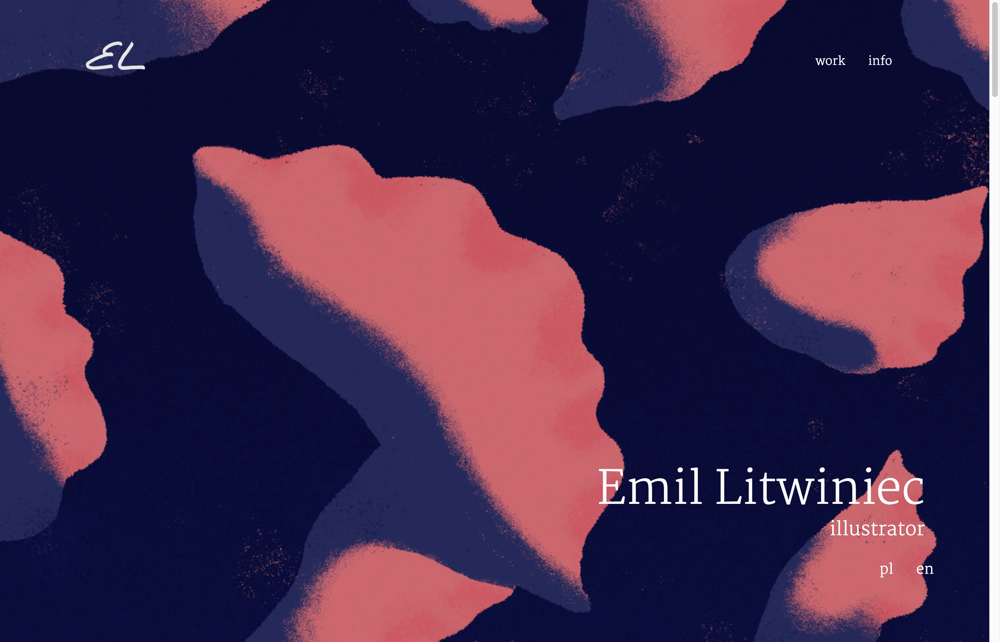
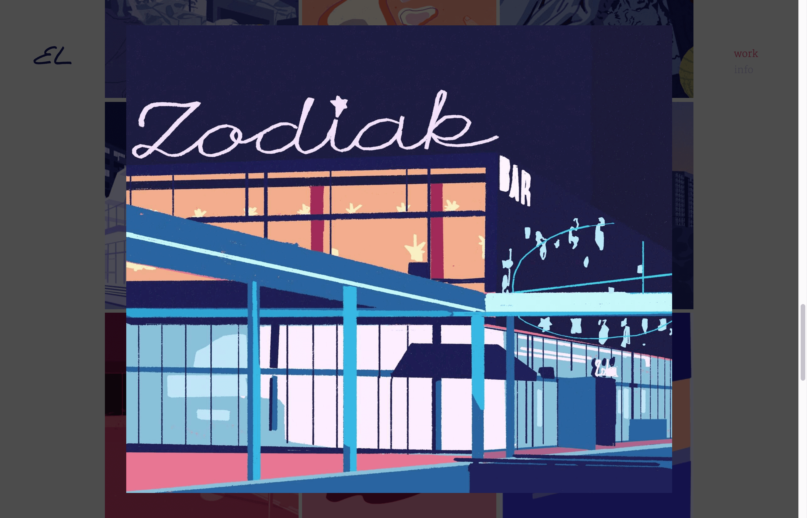
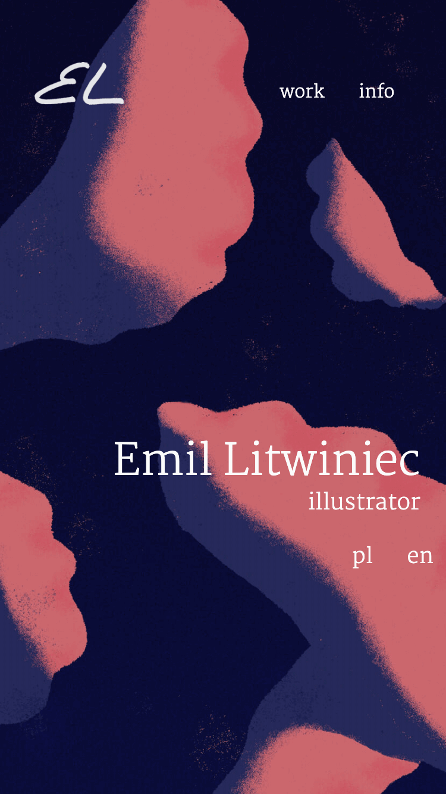
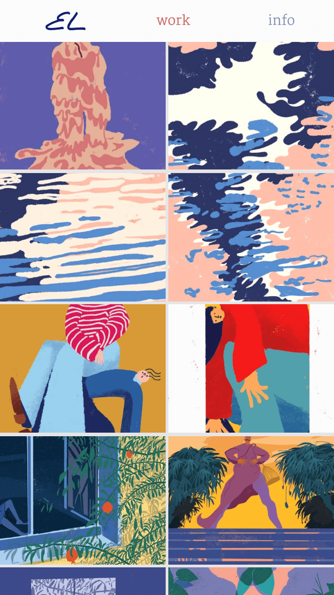

# Illustration Portfolio


Single page website to showcase my illustration works.


## Install

To run website with live-server in development mode:
```
git clone git@github.com:EmilTheSadCat/illustration-portfolio.git
cd illustration-portfolio
npm install
npm start
```


## Features
- Parallax style hero image background movement
- Fully responsive user interface
- Photoswipe gallery with thumbnails in grid
- JS language selection [pl/en]


## Stack

- HTML
- CSS (SASS)
- Vanilla Javascript


## Screenshots

</br>
<sup>Landing page</sup> </br>


</br>
<sup>Grid gallery</sup> </br>


</br>
<sup>About section</sup> </br>


</br>
<sup>Gallery detail</sup> </br>


</br>
<sup>Landing page mobile</sup> </br>


</br>
<sup>Gallery mobile</sup> </br>


## Links

- Live: https://stupefied-mirzakhani-167eb4.netlify.com/
- Repository: https://github.com/EmilTheSadCat/illustration-portfolio


## Licensing

The code in this project is licensed under ISC license.